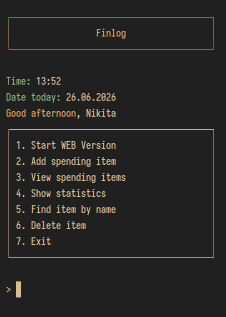
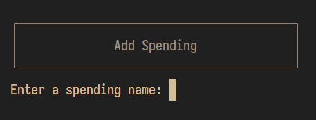
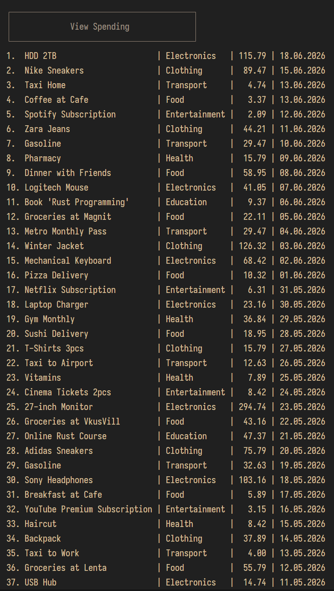
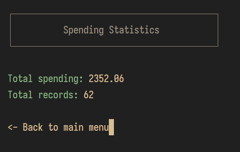
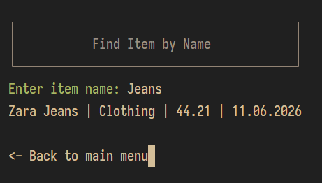
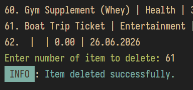
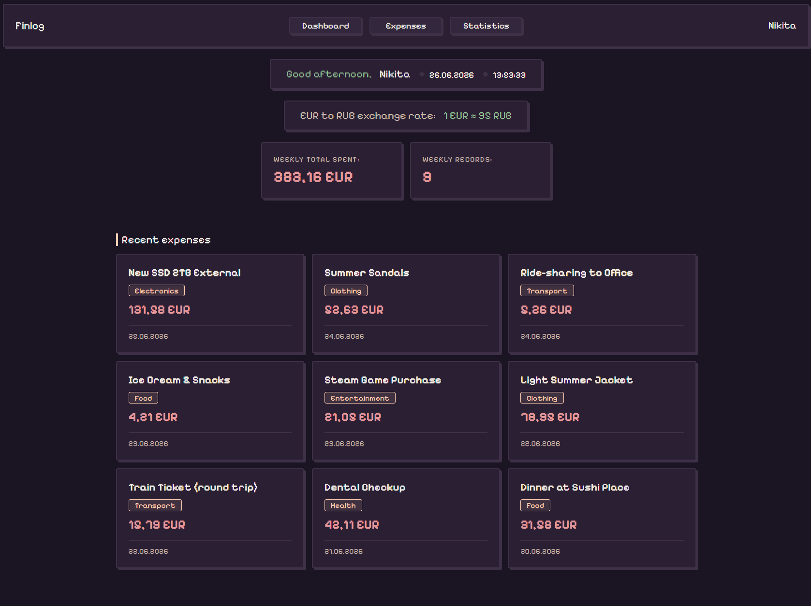
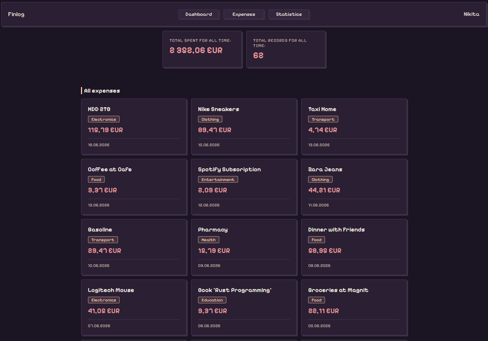
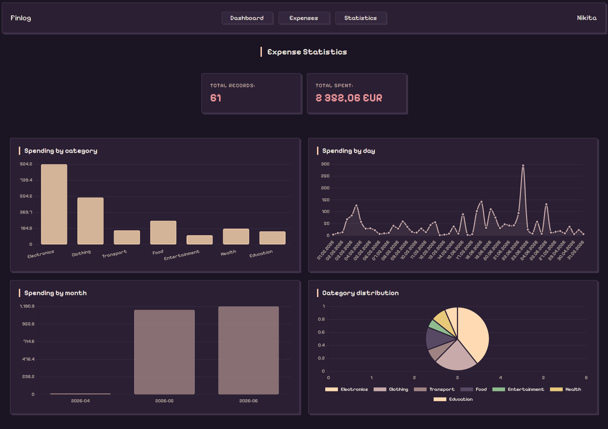

# Finlog

Personal expense tracker with CLI and web interface.

## Stack

<p align="left">
  
  
  
  
  
</p>

## Screenshots

<details>
<summary>CLI</summary>

| Main menu | Add spending | View spending |
|-----------|-------------|---------------|
|  |  |  |

| Statistics | Find item | Delete item |
|-----------|-----------|-------------|
|  |  |  |

</details>

<details>
<summary>Web</summary>

| Dashboard | Expenses | Statistics |
|-----------|----------|------------|
|  |  |  |

</details>

## Features

### CLI
- Add, view, delete and search expenses
- Colored terminal output
- Spending statistics
- Username configuration
- Automatic JSON storage

### Web
- Dashboard with time-based greeting
- Weekly and all-time statistics
- Interactive charts: by category, by day, by month, distribution
- Full expense list
- Responsive design

## Requirements

<p align="left">
  
  
  
</p>

## Quick Start

```bash
git clone https://github.com/wakaranakattari/Finlog.git
cd Finlog
cargo run --release
```

Select option `1` from the menu to start the web version.
On first launch, dependencies are installed and the frontend is compiled automatically.
Open browser at `http://127.0.0.1:3000`.

## Project Structure

```
Finlog/
├── src/
│   ├── core/        # Spending manager
│   ├── storage/     # JSON persistence
│   ├── server/      # Axum web server
│   └── utils/       # Colors, console, error handling
└── web/
    ├── src/
    │   └── finlog/
    │       ├── api.cljs
    │       ├── core.cljs
    │       └── components/
    │           ├── header.cljs
    │           ├── dashboard.cljs
    │           ├── expenses.cljs
    │           └── statistics.cljs
    └── public/
        ├── index.html
        ├── css/
        └── data/
```

## License
```
MIT
```